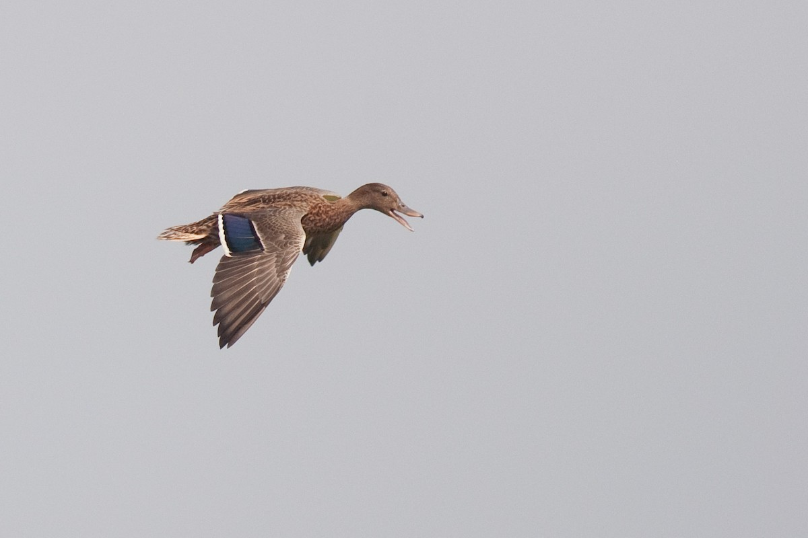

# koloa

**K**eplerian **O**rbits **L**ifted from **O**utlier-**A**ffliction.

[](https://ebird.org/checklist/S24309944)

The koloa is the Hawaiian duck. The package puts the duck test to a radial
velocity signal (does it look, swim and quack like a planet?), and it does so
on data in which some exposures, or whole visits, cannot be trusted.

Every tool in koloa is outlier-aware in the same way. The noise is a mixture:
each exposure, and each visit as a whole, is either good or an outlier whose
variance is inflated by a width W. The indicator of which it is gets summed
over, or sampled; no clip ever decides it. Because the likelihood is Gaussian
given the indicators, every linear parameter (offsets, trends, decorrelation
terms and the amplitudes of circular orbits) can still be integrated out
exactly. That is what makes the outlier-aware FIP affordable.

## What is in the package

| module | what it does |
| --- | --- |
| `koloa.data` | `RVData`: velocities with their instruments, visits (sequences) and activity indicators; reads LBL `.rdb` and csv files |
| `koloa.fip` | the **outlier-aware false inclusion probability (OAFIP)**: the Hara et al. (2022) FIP periodogram with up to `kmax` signals, a visit jitter and point or visit outliers; also the single-signal FIP with a fixed noise (fast, Hara-comparable) and the soft- and hard-clip versions, side by side |
| `koloa.periodogram` | GLS, the **outlier-aware periodogram (OAP)** (profile likelihood with the mixture), leave-one-visit-out jackknife, window, aliases |
| `koloa.fit` | `RVModel`: any number of orbits (circular or eccentric; transiting planets with ephemeris priors), a GP (SHO, rotation, quasi-periodic, SE, Matern-3/2), per-instrument offsets and jitters, a visit jitter, and gaussian, Student-t or mixture noise, all fitted **jointly**; MAP with a Laplace covariance, and MCMC. `mcmc_orbits` goes from a series to the posterior of the orbital elements in one call, and runs until the chain holds 50 autocorrelation times |
| `koloa.diagnostics` | coherence of amplitude and phase through the campaign, activity indicators at P, 2P and 3P, eccentricity at the prior edge, absorption by a GP, and `duck_test`, which runs them all |
| `koloa.plotting` | every point coloured by its outlier probability (blue reliable, grey undecided, red outlier, and hollow when more likely an outlier than not); phase folds with binned means and a 1-sigma envelope; per-visit views; periodograms side by side; corner plots that overlay several posteriors, one colour each |
| `koloa.simulate` | series with known planets, activity and realistic outliers: single spikes, bad visits, flares and heavy tails, clear or borderline (`CLEAR`, `BORDERLINE`, `REALISTIC`), drawn on a real observing window when one is given |
| `koloa.completeness` | recovery rates on a grid of period and K: planets injected into a series and looked for by folding it at their period with the outlier-aware likelihood (or a blind search), with the false-alarm rate measured at K = 0 |
| `koloa.secular` | the acceleration of a star in both senses of "secular acceleration": `acceleration(fit)` reads the trend of a fit as the acceleration of the star (m/s/yr) and its change (m/s/yr^2), with their errors; `companion_min_mass(accel, distance, separation)` gives the smallest companion that makes it (Torres 1999); and the perspective acceleration mu^2 d from the Gaia DR3 astrometry, with its error propagated from the covariance of the proper motions and the parallax, which `RVModel(perspective=(value, error))` fits as a parameter with that prior (only for velocities whose barycentric correction did not remove it; APERO's did) |
| `koloa.outliers` | why an outlier is an outlier: `explain_outliers(fit)` compares every outlier (a whole visit, or a single exposure) with the good data on everything recorded with it, the header keywords of LBL files (smart lists for SPIRou and NIRPS: S/N, airmass, telluric absorption, the shape of the image, the Fabry-Perot, the age of the wavelength solution...), DACE's columns for HARPS and ESPRESSO, the activity indicators and the error bars; which keys are significantly off for each outlier, and which the outliers share |
| `koloa.dace` | the public velocities of a star on DACE, every instrument, one instrument per era, with every column kept |
| `koloa.archive` | the names of a star (CDS Sesame) and its planets in the NASA Exoplanet Archive, with every published solution; a fitted K against them, the most recent first |
| `koloa.radvel_bridge` | `OutlierRVLikelihood`, a drop-in replacement for radvel's `RVLikelihood` |
| `koloa.doppler` | relativistic Doppler conversions (velocity, wavelength ratio, log-wavelength shift) |
| `koloa.analyze` | all of the above on one series, with a report and figures |
| `koloa.detailed` | `detailed_analysis`: everything koloa can say about a star from one file, with its known planets (archive), more data (DACE, the velocities published with its planets on VizieR, and any given), the FIP in two passes, the known planets tested at their periods, a GP of the activity, the activity indicators and why each outlier is one, as a LaTeX/PDF report |
| `koloa.literature` | published velocities: a VizieR .dat or csv file read (times to BJD - 2400000, km/s to m/s), and the tables of the papers of a star's planets found on VizieR from their bibcodes |
| `koloa.gpcheck` | the signals against a GP of the activity (its prior the rotation period of the archive): the likelihood each adds, periodograms whitened by the GP with false-alarm levels from simulations of its noise, and the whole series with the GP |
| `koloa.latex` | the detailed analysis as a LaTeX report, compiled to PDF by pdflatex |

## Install

koloa needs numpy, scipy and matplotlib. emcee (for posteriors), radvel (the
bridge and cross-checks), astropy and threadpoolctl are optional and are
imported only when used.

```
git clone https://github.com/eartigau/koloa.git
cd koloa
pip install -e .            # the package and the `koloa` command
pip install emcee radvel    # optional: posteriors, radvel bridge
```

## Use

From the command line, on an LBL `.rdb` (rjd, vrad, svrad and the indicators):

```
koloa data/kepler21_harpsn_dace_drs3.3.12.csv --outdir kepler21 --kmax 3
```

This writes periodograms, FIPs, a fit, the duck test and every figure into
`kepler21/`, with a text report and a JSON summary.

The detailed analysis goes further, from one LBL `.rdb`:

```
koloa star.rdb --detailed --outdir star
```

It finds who the star is (SIMBAD, from the OBJECT column or `--target`),
its known planets in the NASA Exoplanet Archive (every published solution),
and more velocities on DACE (the public ones of every other instrument,
merged with the file; DACE answers from some networks only, and the
analysis goes on without it). Then the FIP of every instrument together in
two passes (the errors of each instrument inflated to its noise, first
without planets, then with them), the signals fitted together and set
against the known planets, the activity indicators, the duck test, and why
each outlier is one. From Python: `koloa.detailed_analysis('star.rdb')`.

Beyond the FIP's signals, the known planets are tested at their periods,
and so are the periods given (`--periods 113.46`, a candidate the archive
does not list). The velocities published with the known planets are
fetched from VizieR (from the bibcodes of their solutions in the archive;
`--no-vizier` not to), and published velocities can be given
(`--literature paper_rvs.dat`: a VizieR .dat, or a csv or .rdb with named
columns); a published velocity within a minute of an exposure of the file
is the same spectrum and is left out. The signals are fitted again with a
GP of the activity (the rotation period of the archive as its prior, a
free period otherwise): the likelihood each adds over the GP, periodograms
whitened by the GP with their false-alarm levels, and the whole series
with the GP overplotted, season by season (`--no-gp` not to). Everything
goes into `<star>_report.pdf`, a LaTeX report compiled by pdflatex when
there is one (`<star>_report.tex` otherwise; `--no-latex` for neither):
the star, the data and where they come from, the known planets and their
published solutions, the FIP, the signals against the known planets
(their K and the published ephemeris carried to the data), the GP, the
duck test of each signal, the activity indicators and the rotation, the
outliers, and every figure.

From Python:

```python
import numpy as np

import koloa

data = koloa.RVData.from_csv('series.rdb', name='My star')

# the outlier-aware FIP, up to three signals
fip = koloa.oafip(data, kmax=3, outliers='both')
print(fip.summary())
reliability = 1 - fip.outlier_prob          # per exposure

# a joint fit: one transiting planet, a Matern-3/2 GP, bad visits
model = koloa.RVModel(
    data, [dict(period=5.7998164, period_err=3.5e-6, tc=58795.82368,
                tc_err=4.1e-4)],
    gp=dict(kernel='matern32', prior={'log_length': (np.log(50), 0.3)}),
    likelihood='mixture', unit='sequence')
fit = model.fit()
post = model.sample()                       # MCMC

# is it a planet?
report = koloa.duck_test(data, period=11.2, fipres=fip)
print(report.text())
# the same as a detailed PDF: every check with its figures, and the known
#   planets of the star from the NASA Exoplanet Archive (target: its name)
report = koloa.duck_test(data, period=fip.best()['period'], fipres=fip,
                         pdf='duck.pdf', target='GJ 687')
# or everything in a folder: the PDF, each figure as a PDF of its own, the
#   text of the test and a JSON summary (checks, orbit, archive); with a
#   report, the TESS light curves of the star are fetched too and searched
#   for a photometric peak at P, P/2, P/3 or 2P (koloa.tess; tess=False
#   to skip)
report = koloa.duck_test(data, period=fip.best()['period'], fipres=fip,
                         outdir='duck_GJ687', target='GJ 687')
```

### Orbital elements by MCMC

`koloa.mcmc_orbits` finds the maximum a posteriori (each period candidate kept
inside its own periodogram peak, so the search cannot jump to an alias), then
samples the posterior with emcee (differential-evolution moves) until the chain
holds 50 autocorrelation times of every parameter.

```python
from koloa import plotting as kplot

# the same orbit, with and without the outlier mixture
koloa_fit = koloa.mcmc_orbits(data, [11.2], likelihood='mixture')
gauss_fit = koloa.mcmc_orbits(data, [11.2], likelihood='gaussian')

post = koloa_fit.posterior(mstar=0.6)   # every draw: P_0, K_0, e_0, omega_0,
                                        # tp_0, tc_0, msini_0, jit_*, sjit, ...
print(koloa_fit.orbits(mstar=0.6)[0])   # medians and 68 % intervals
print(koloa_fit.diagnostics['tau_max'], koloa_fit.diagnostics['n_eff_min'])

fig = kplot.corner(
    [dict(samples=gauss_fit.posterior(), label='gaussian', color='gaussian'),
     dict(samples=post, label='koloa', color='koloa')],
    ['P_0', 'K_0', 'e_0', 'omega_0', 'sjit'])
kplot.savefig(fig, 'corner.pdf')
```

## Three choices that matter

**What an outlier is.** `unit='point'` lets single exposures be outliers.
`unit='sequence'` does the same for whole visits: the exposures taken back to
back move together when the calibration drifts, the moon is near or a cloud
passes. `unit='both'`, the default, allows both kinds. Visits are found from
the time stamps (a gap of more than 0.3 d starts a new one), per instrument.

**The visit jitter.** Exposures of one visit share more than their photon
noise. When they do, counting them as independent overstates the evidence of
any signal by roughly the number of exposures per visit. koloa fits a jitter
common to the exposures of a visit, `seq_jitter`, and turns it on whenever
visits hold more than one exposure. With several instruments whose excess
noise differs (activity is weaker in the near infrared than in the optical),
`RVModel(..., seq_jitter='instrument')` gives each instrument whose visits
hold several exposures its own visit jitter (`sjit_<inst>`), the others
keeping their white jitter: one visit jitter for all would give the quieter
instrument too much and hide its bad visits.

**A GP per instrument.** `gp` also takes a list, one GP per group of
instruments, each with its own kernel and parameters
(`gp_<name>_<parameter>`); the groups are independent (a block-diagonal
covariance), e.g.
`gp=[dict(kernel='matern32', instruments=['NIRPS']),
dict(kernel='matern32', instruments=['HARPS03', 'HARPS15'], name='HARPS')]`.
A single GP can instead be made chromatic, `gp=dict(kernel=...,
scale='instrument', reference='NIRPS')`: one kernel, and an amplitude per
instrument relative to the reference's. `FitResult.gp_prediction(time,
inst=...)` then predicts the GP of that instrument.

**Joint fits.** A GP fitted first leaves an orbit only what it could not take.
`koloa.sequential_fit` exists to show this, and raises a `KoloaWarning`. With a
GP the visits and the exposures both carry latent outlier indicators, each drawn
from its exact leave-one-out conditional.

**Many outliers.** A fit started from "no outliers" can stay there when half the
points are bad. koloa also starts from the least deviant 70 and 50 % of the
units, as polyband does, and lets the likelihood choose.

**Drifts.** A star pulled by a companion far out accelerates: fit a trend
(`trend=1`, or 2 for its change) and read it with `koloa.secular.acceleration`
in m/s/yr, with errors that koloa's likelihood keeps honest under outliers;
`companion_min_mass` turns it into the smallest companion at a given
separation. A nearby star also drifts by its perspective acceleration (4.5
m/s/yr for Barnard's star); `koloa.secular` gets it from Gaia with its error,
and a trend fitted beside it takes the acceleration of the star itself.
Check first that your velocities still hold it: a barycentric correction given
the proper motion and the parallax of the star removes it (barycorrpy does,
and APERO gives it the Gaia astrometry of every SPIRou and NIRPS target), and
adding the term to such velocities counts it twice.

## Demos

Each script in `demos/` writes PDF figures to `demos/output/<demo>/`, SVG
versions to `docs/figures/`, and the numbers of the web page to
`demos/output/<demo>/summary.json`. `demos/run_all.sh` runs them all (about two
hours on ten cores, one BLAS thread per process).

The simulations use a real NIRPS sampling (`data/nirps_template.csv`: the
times and error bars of 181 exposures, without their velocities). The data
of Kepler-21 and HD 69830 are public (DACE) and in `data/`; the series of the
other stars (GL 725 A and B, TOI-2120, GJ 687, Barnard's star, Proxima) belong
to the SPIRou and NIRPS teams and are not in this repository, so their demos
run only where those files are; their results are on the website,
<https://eartigau.github.io/koloa/>.

| script | what it shows |
| --- | --- |
| `demo_false_alarm.py` | no planet and a few bad visits: the fixed-jitter FIP finds a "planet"; koloa finds nothing and flags the bad exposures |
| `demo_recovery.py` | a K = 5 m/s planet behind bad visits and spikes: the gaussian and soft-clip FIPs miss it, koloa recovers it and its amplitude |
| `demo_two_planets.py` | two planets and outliers: one FIP periodogram, and the posterior on the number of signals |
| `demo_gp_joint.py` | activity, a planet and bad visits: the joint GP + orbit fit against the sequential one |
| `demo_posterior.py` | the posterior of an eccentric orbit by MCMC, gaussian and koloa, with and without outliers, as corner plots; then the bias and coverage of the intervals over many realisations |
| `demo_completeness.py` | recovery maps in period and K with outlier-aware folding, gaussian against koloa, on simulated series and on GL 725 B and Kepler-21 |
| `demo_contamination.py` | how many outliers a fit can take: least squares, polyband's Student-t, koloa's Student-t and koloa's mixture, on a polynomial and on an orbit |
| `demo_secular.py` | the acceleration of a star: an ensemble of series with a companion drift and outliers, fitted with the Gaussian likelihood and koloa's; what the accelerations of GL 725 A and B ask of each other; and the perspective acceleration of every star from Gaia DR3 |
| `demo_gl725b.py` | GL 725 A and B (SPIRou): each drifts by the pull of the other (APERO has already removed their secular accelerations), in the inverse ratio of their masses; then the whole analysis of B |
| `demo_kepler21.py` | Kepler-21 b (HARPS-N, DACE): a small transiting planet under stellar activity, the rotation from the S index as the GP prior |
| `demo_mdwarfs.py` | three M dwarfs with more than 150 visits (GJ 687 and Barnard's star with SPIRou, Proxima with NIRPS), cleaned by PCA2D: the analysis and duck test, the known planets by MCMC in the corrected and delivered series, the drift left by APERO, recovery maps |
| `demo_toi2120.py` | the real SPIRou series of TOI-2120 (PCA2D nominal): a Matern-3/2 GP, the transiting planet, four outlier visits in the data as observed, and bad visits added in amplitude and in number |
| `demo_dace.py` | a known planetary system from DACE: the public velocities of HD 69830 from four instrument eras (HARPS and ESPRESSO), fetched by `koloa.dace`, the FIP of every instrument together (`koloa.fip.inflate_to_fit`), the planets by MCMC, and the NASA Exoplanet Archive for comparison |
| `demo_rotation.py` | the rotation of GJ 687 from its temperature indicator (DTEMP3500, SPIRou): an SHO GP with koloa's outlier-aware likelihood and with a gaussian one, sampled by MCMC, their corner plot, and the period under added bad visits |
| `demo_outliers.py` | why the outliers of GJ 687 (SPIRou), Proxima (NIRPS) and HD 69830 (HARPS, public) are outliers: their known planets fitted with the mixture, and every outlier against the header keywords, the indicators and the error bars |
| `demo_radvel.py` | the radvel bridge |

## Tests

```
PYTEST_DISABLE_PLUGIN_AUTOLOAD=1 python -m pytest tests
```

The FIP machinery is checked against brute force: dense matrices, and
posteriors summed over every configuration of signals and outliers. The
orbits are checked against radvel and the kernels against celerite2.

## Conventions

Times are in days, velocities in m/s. koloa works in velocity; when a
velocity has to become a wavelength shift (or a pixel shift on a
log-wavelength grid read back as a velocity), `koloa.doppler` does it
relativistically, never with the first-order (1 + v/c), which is off by
1.5 m/s at a 30 km/s barycentric correction. Figures are saved as PDF (the
paper style) or SVG (the web style), never PNG.

## Citing

The method is described in `paper/koloa.tex`. The FIP is that of Hara et al.
(2022, A&A 663, A14); the outlier mixture follows Box & Tiao (1968) and Hogg,
Bovy & Lang (2010).
